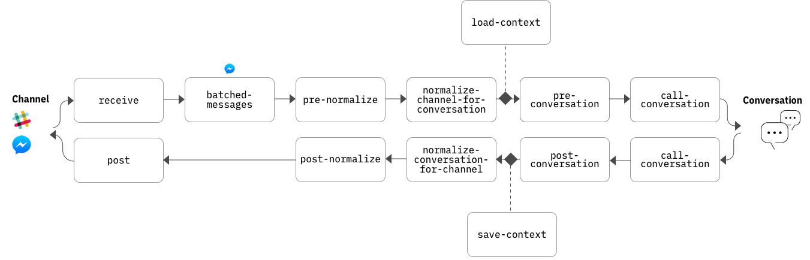

# Deploying with the Conversation connector

The Conversation connector is a set of IBM Cloud Functions components that mediate communication between your Conversation workspace and a Slack or Facebook app, storing session data in a Cloudant database. You can use the connector to quickly deploy your workspace as a chat bot that Slack or Facebook Messenger users can interact with.

For information about how to deploy your workspace using the Conversation connector, see the appropriate README:

- [Deploying a Facebook Messenger app](channels/facebook/README.md)
- [Deploying a Slack app](channels/slack/README.md)

The following sections provide detailed information about the architecture of the Conversation connector.

## Architecture overview

The Conversation connector consists of a set of Node.js functions deployed as Cloud Functions actions. These actions enable users on the channel (Slack or Facebook Messenger) to communicate with a Watson Conversation workspace, and to receive responses. The Conversation connector handles conversion of messages between the Conversation and channel formats, sending messages using REST APIs, and managing conversation context. Each action is fully customizable. Collectively, the series of actions through which a message flows is referred to as the _pipeline_.

This diagram illustrates the default configuration of a Conversation connector deployment.



The most basic function of the pipeline is to transfer text-based messages from a channel user to the Conversation workspace and then back again. This basic function is implemented by the following core actions:

- **`receive`**: Receives user input from the channel app.
- **`normalize-<channel>-for-conversation`**: Converts the user input to the Conversation service format.
- **`call-conversation`**: Sends the user input to the Conversation service and receives the response.
- **`normalize-conversation-for-<channel>`**: Converts the response to the channel's native format.
- **`<channel>/post`**: Sends the response to the channel app, which displays the response to the user.

In addition to these core actions, other actions handle support functions, maintain state, and provide extension points for customization, as described below.

### Detailed action descriptions

The Conversation connector functions by exchanging JSON data between Cloud Functions actions. The `receive` action receives the input in the channel's JSON format and passes this JSON data to the next action in the pipeline. Each subsequent action in the pipeline receives JSON data from the previous action, performs its processing (which might include modifying the JSON), and then exits by returning a JSON object. This returned JSON is then passed to the next action in the pipeline, until the user finally receives the response.

The following list provides a detailed description of all of the actions that make up the pipeline. (In the action names, `<channel>` is either `slack` or `facebook`, depending on the type of deployment.)

- **`receive`** is the entry point of a message. This action receives the raw JSON data from the channel, in the channel's native format, and passes it along the pipeline to the next action.
- **`batched_messages`** handles batched Facebook messages. (This action is not included in a Slack deployment.) It sorts incoming messages by user, and then handles each user's messages in parallel. For more information about Facebook's concept of batching messages, see the [Facebook documentation](https://developers.facebook.com/docs/messenger-platform/webhook/).
- **`pre-normalize`** performs any custom preprocessing of the raw message before the normalization step. By default, this action is empty, but you can customize it to modify the input or perform any other actions your bot requires.
- **`normalize-<channel>-for-conversation`** converts the JSON data from the channel's format to the format expected by the Conversation service. This includes exctracting the user utterance text from the channel JSON (`message.text` for Facebook Messenger or `event.text` for Slack), and storing it as `input.text` in the Conversation JSON.
- **`load-context`** loads the most recently stored Conversation context from the Cloudant `contextdb` database. Context is stored separately for each unique user who is interacting with the bot. (In the case of Slack, a single user might have multiple unique conversations with the bot, one through direct messages and one in each channel.) For more information about the Cloudant databases, see [Cloudant databases](#cloudant-databases).
- **`pre-conversation`** performs any custom processing of the Conversation JSON before the input is sent to the Conversation service. By default, this action is empty.
- **`call-conversation`** uses the Conversation Node.js SDK to send the message to the Conversation workspace and receive the Conversation response.
- **`post-conversation`** performs any custom processing of the Conversation response JSON. This is an opportunity to modify the received context before it is saved in the database. By default, this action is empty.
- **`save-context`** saves the Conversation context in the Cloudant `contextdb` database.
- **`normalize-conversation-for-<channel>`** converts the JSON response from the Conversation format to the format expected by the channel. This includes extracting the Conversation response text from the `output.text` field of the Conversation JSON, and storing it in the appropriate location in the channel JSON (`message.text` for Facebook Messenger or `text` for Slack).
- **`post-normalization`** performs any final processing of the channel JSON before it is posted to the channel.
- **`post`** posts the output to the channel app.

## Interactive messages

In addition to basic text responses, both Facebook Messenger and Slack support responses that include interactive controls such as buttons and menus. The connector pipeline provides basic passthrough support for any channel-specific JSON, which you can use to implement interactive responses:

1.  If you are using Slack, make sure you have enabled the interactive message support. For more information, see the Slack deployment [README](channels/slack/README.md#interactive-messages).

1.  In the Conversation tool, edit the dialog node that you want to return an interactive response. Insert the channel-specific JSON into the `output.<channel>` field.

For example, for Slack, you might use the following JSON to display buttons for selecting a T-shirt size:

```json
{
  "output": {
    "text": {
      "values": [
        "What shirt size would you like?"
      ],
      "selection_policy": "sequential"
    },
    "slack": {
      "text": "What shirt size would you like?",
      "attachments": [
        {
          "actions": [
            {
              "name": "shirt_size_small",
              "text": "Small",
              "type": "button",
              "value": "small"
            },
            {
              "name": "shirt_size_medium",
              "text": "Medium",
              "type": "button",
              "value": "medium"
            },
            {
              "name": "shirt_size_large",
              "text": "Large",
              "type": "button",
              "value": "large"
            }
          ],
          "fallback": "Sorry! We cannot support buttons at the moment. Please type in: small, medium, or large.",
          "callback_id": "shirt_size"
        }
      ]
    }
  }
}
```
The connector will include this data in the `attachment` property of the Slack JSON, and Slack will show the user the buttons they can click on in the client. (For more information, see Slack's [message attachment's documentation](https://api.slack.com/docs/message-attachments).)

For Facebook Messenger, the approach is the same, but the JSON details differ:

```json
  "output": {
    "facebook": {
      "message": {
        "text": "Which size would you like?",
        "quick_replies": [
          {
            "title": "Small",
            "payload": "small",
            "content_type": "text"
          },
          {
            "title": "Medium",
            "payload": "medium",
            "content_type": "text"
          },
          {
            "title": "Large",
            "payload": "large",
            "content_type": "text"
          }
        ]
      }
    }
  }
```

For more information, see [Facebook's message template pages](https://developers.facebook.com/docs/messenger-platform/send-messages/templates).

## Customizing the pipeline

The entire Conversation connector framework is customizable. The easiest way to add functions to the pipeline is to add your custom code to the stub functions that are provided for this purpose (`pre-normalize`, `pre-conversation`, `post-conversation`, and `post-normalize`). For example,if the Conversation service detects that a user is asking about an account balance (as indicated by a returned intent), you could modify the `post-conversation` action to make a database call to retrieve the balance and then modify the response before it is posted to the channel.

For more extensive customization, you might want to add, remove, or change code in other pipeline actions. For more information about editing Cloud Functions actions, see [the Cloud Functions documentation](https://console.bluemix.net/docs/openwhisk/openwhisk_actions.html#openwhisk_actions).

To browse and edit the deployed actions, use the [Cloud Functions editor](https://console.bluemix.net/openwhisk/manage/actions?env_id=ibm:yp:us-south). The actions are deployed in several Cloud Functions packages, as follows:

- `slack` package (Slack deployments only):
    - `receive`
    - `post`
- `facebook` package (Facebook deployments only):
    - `receive`
    - `batched_messages`
    - `post`
- `starter-code` package:
    - `pre-normalize`
    - `normalize-slack-for-conversation` (Slack deployments only)
    - `normalize-facebook-for-conversation` (Facebook deployments only)
    - `pre-conversation`
    - `post-conversation`
    - `normalize-conversation-for-slack` (Slack deployments only)
    - `normalize-conversation-for-facebook` (Facebook deployments only)
    - `post-normalization`
- `context` package:
    - `load-context`
    - `save-context`
- `conversation` package:
    - `call-conversation`

The actual names of the deployed actions are as follows:
    `<deployment_name>_<package_name>/<action_name>`
where `<deployment_name>` is the deployment name you specify during deployment. For example, if you have a Slack deployment called `MyDeployment`, you would see the `receive` action listed as `MyDeployment_slack/receive`.

## Cloudant databases

In addition to the Cloud Functions actions, the deployment creates two Cloudant databases that support the connector. These databases are created using the Cloudant service instance created in the specified IBM Cloud organization and space during the deployment process. (If you deploy multiple Conversation connectors for different workspaces or channels, the same Cloudant service instance and databases are used for all of them.)

- **`authdb`**: Used to store authentication information. This database contains a separate authentication document for each deployment, storing the authentication information for a particular Conversation workspace and channel app. This information consists of Conversation service credentials and channel tokens, which the Conversation connector uses when communicating with the Conversation service and with the channel. Each document in the `authdb` database is associated with a particular deployment using a UUID that is generated during the deployment process.

    The appropriate Cloudant URL, database name, and authorization key are stored in an annotation on each Cloud Functions package that needs to access the database. The actions in the package use the information in these annotations to retrieve the correct document from the `authdb` database.

- **`contextdb`**: Used to store the most recent Conversation dialog context returned from the workspace. The `save-context` action stores the context JSON in the database after each Conversation response, and the `load-context` action loads it from the database before the next user message is sent. For more information about what the context can contain, see the [Conversation documentation](https://console.bluemix.net/docs/services/conversation/dialog-build.html#context).

    As with the `authdb` database, Cloud Functions package annotations are used to store the Cloudant url for accessing the database.

For more information about how the Cloud Functions actions interact with Cloudant, see the [Node SDK for Cloudant](https://github.com/cloudant/nodejs-cloudant). For more information about the underlying Cloudant REST APIs, see the [Cloudant documentation](https://docs.cloudant.com/document.html).

## Troubleshooting

If you are having trouble with the deployment process or with a deployed bot, the following information may help you get things running properly.

### Deployment troubleshooting

Errors may occur during the deployment process (either UI-based or manual) for various reasons. The following are some of the most common:

- Unsupported IBM Cloud regions

When deploying the Conversation connector, make sure you do not specify any IBM Cloud region other than US South, as this is currently the only supported region. (If you are deploying for Slack using the Conversation tool, US South is automatically used.) Your Conversation service instance must also be in the US South region.

- Lack of Cloud Functions privileges

In order to successfully deploy all assets, especially the Cloudant database, you must have developer permissions (or higher) for the IBM Cloud Functions space you are deploying to.

- Not enough IBM Cloud service instances available

Deployment requires a Cloudant NoSQL Lite instance named `conversation-connector`. If this service instance does not already exist, and there are not enough free service slots in the user's IBM Cloud account to create it, the deployment fails. If this happens, try a different IBM Cloud account, or remove some unnecessary service instances, so at least one unused slot is available.

- Invalid keys or credentials

During the deployment process, you specify credentials and keys used to access the Conversation workspace and the channel app. If this information is entered incorrectly, unpredictable results can occur both during deploy and at run time. If you are not sure whether the credentials you provided are correct, the best solution is to start over with a new deployment. If you use the same deployment name, the new deployment will overwrite the previous deployment, which might fix the problem.

- Manual deployment errors

If you are running the deployment manually using command-line tools, make sure you have installed the most current versions of the prerequisite software:

- The [Cloud Foundry command-line interface](https://docs.cloudfoundry.org/cf-cli/install-go-cli.html)
- The [Node.js runtime](https://nodejs.org/), including the npm package manager
- The IBM Cloud Functions [wsk tool](https://console.ng.bluemix.net/openwhisk/learn/cli) (scroll down to **Looking for the wsk CLI?**)

### Dependency Troubleshooting

The Conversation connector depends on IBM Cloudant as well as IBM Cloud Functions. Although both of these products should function properly using the default settings, you might run into problems if any configuration changes are made.

For information about these products, see the [Cloud Functions documentation](https://console.bluemix.net/docs/openwhisk/index.html#getting-started-with-openwhisk) and the [IBM Cloudant documentation](https://console.bluemix.net/docs/services/Cloudant/cloudant.html#overview).